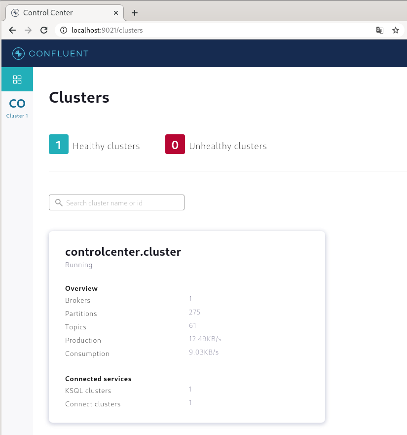
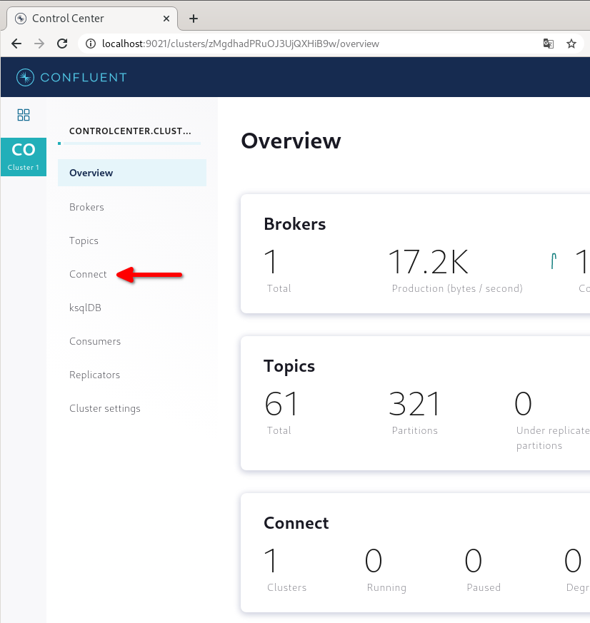
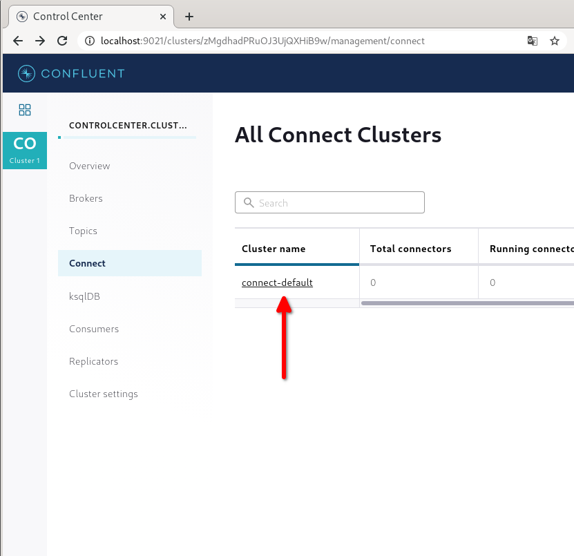
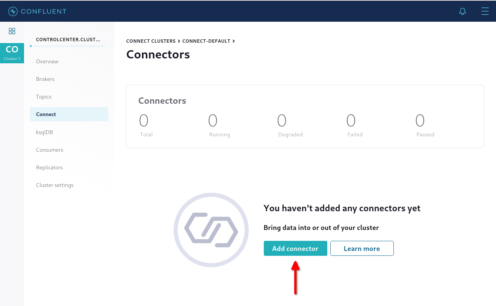
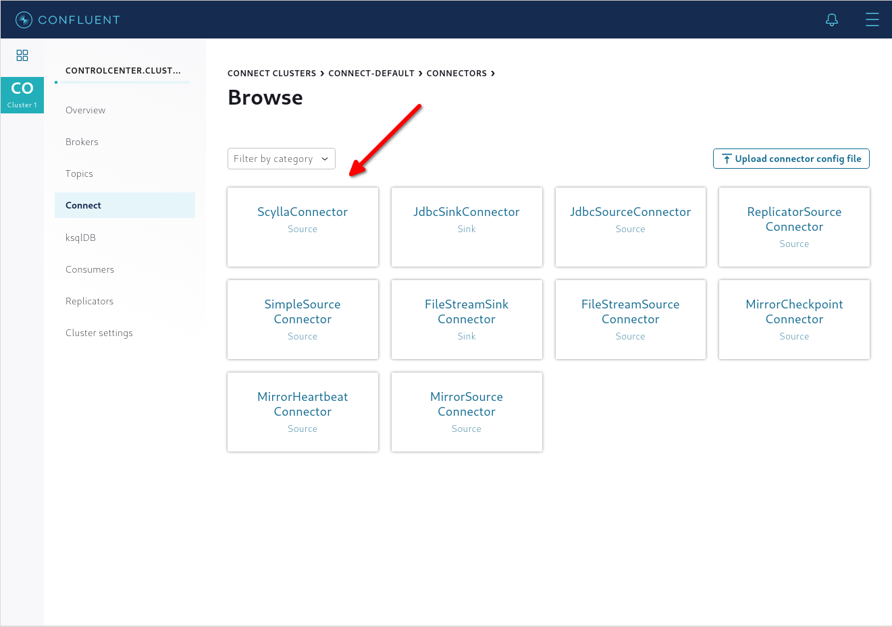
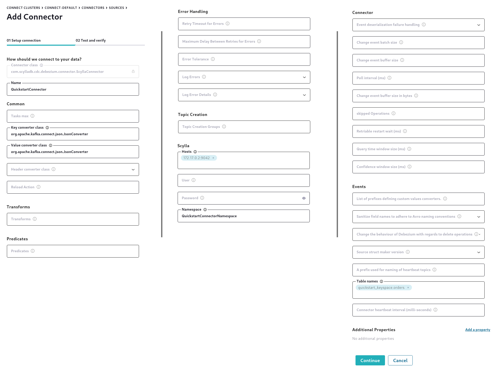
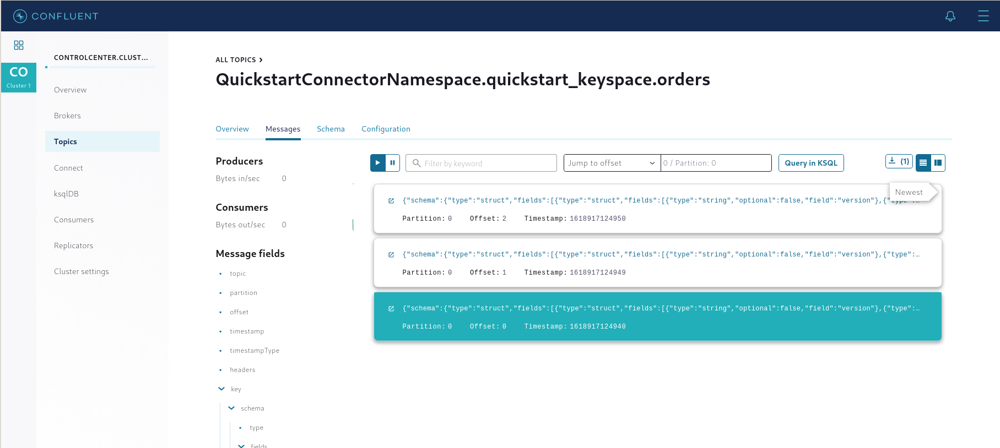

# Scylla CDC Source Connector Quickstart

## Synopsis

This quickstart will show you how to setup the Scylla CDC Source Connector to replicate changes made in 
a Scylla table using [Scylla CDC](https://docs.scylladb.com/using-scylla/cdc/cdc-intro/).

## Scylla setup

First, let's setup a Scylla cluster and create a CDC-enabled table.

### Scylla installation

For the purpose of this quickstart, we will configure a Scylla instance using Docker. You can skip this 
section if you have already installed Scylla. To learn more about installing Scylla in production
environments, please refer to the [Install Scylla page](https://docs.scylladb.com/getting-started/install_scylla/).

1. Using [Docker](https://hub.docker.com/r/scylladb/scylla/), follow the instructions to launch Scylla.
2. Start the Docker container, replacing the `--name` and `--host name` parameters with your own information. For example:
   ```
   docker run --name scylla-cdc-quickstart --hostname scylla-cdc-quickstart -d scylladb/scylla
   ```
3. Run `docker ps` to show the exposed ports. The output should be similar to this example:
    ```
    docker ps 
    
    CONTAINER ID        IMAGE               COMMAND                  CREATED             STATUS              PORTS                                                            NAMES
    4fca02217055        scylladb/scylla     "/docker-entrypoint.…"   8 seconds ago       Up 7 seconds        22/tcp, 7000-7001/tcp, 9042/tcp, 9160/tcp, 9180/tcp, 10000/tcp   scylla-cdc-quickstart
    ```
   
### Creating a CDC-enabled table

Let's connect to your Scylla cluster and create a new CDC-enabled table. We will create an example table by 
issuing the following CQL query and insert some example data:

```
CREATE KEYSPACE quickstart_keyspace WITH REPLICATION = {'class': 'SimpleStrategy', 'replication_factor': 1};

CREATE TABLE quickstart_keyspace.orders(
  customer_id int, 
  order_id int, 
  product text, 
  PRIMARY KEY(customer_id, order_id)) WITH cdc = {'enabled': true};

INSERT INTO quickstart_keyspace.orders(customer_id, order_id, product) VALUES (1, 1, 'pizza'); 
INSERT INTO quickstart_keyspace.orders(customer_id, order_id, product) VALUES (1, 2, 'cookies');
INSERT INTO quickstart_keyspace.orders(customer_id, order_id, product) VALUES (1, 3, 'tea');
```

If you already have a table you wish to use, but it does not have CDC enabled, you can turn it on by using the following CQL query:
```
ALTER TABLE keyspace.table_name with cdc = {'enabled': true};
```

To learn more about Scylla CDC, visit [Change Data Capture (CDC) page](https://docs.scylladb.com/using-scylla/cdc/).

## Kafka setup

Scylla CDC Source Connector works well with both [open-source Kafka](https://kafka.apache.org/) 
and [Confluent Platform](https://www.confluent.io/). Kafka version 2.6.0 or greater is
required. In this quickstart we will show how to install the Confluent Platform and deploy 
the connector (applicable to both open-source Kafka and Confluent Platform).

### Installing Confluent Platform

If you are new to Confluent, [download Confluent Platform](https://www.confluent.io/download/).

1. In the *Download Confluent Platform* section fill in your email address
2. Open the *Select Deployment Type* drop-down and select *ZIP*
3. Accept the Terms & Conditions and click *DOWNLOAD FREE*
4. You will receive an email with instructions. Download / move the file to the desired location
5. Continue with the setup following [this document](https://docs.confluent.io/current/quickstart/ce-quickstart.html#ce-quickstart)

### Installing Scylla CDC Source Connector

1. Download or build Scylla CDC Source Connector using [the project build instructions](https://github.com/scylladb/scylla-cdc-source-connector#building)
2. Deploy the connector:
   1. If you use Confluent Platform, move connector JAR files to the `share/java` folder
   2. If you use open-source Kafka, make sure that `plugin.path` of Kafka Connect configuration contains the folder with connector JAR files

## Connector configuration

After you have successfully configured Scylla and Kafka, the next step is to configure the connector
and start it up.

### Configuration using Confluent Control Center

If you use Confluent Platform, the easiest way to configure and start up the Scylla CDC Source Connector
is to use Confluent Control Center web interface.

1. Open the Confluent Control Center. By default, it is started at port `9021`:
    
    
2. Click on the cluster you want to start the connector in and open the "Connect" tab:
    

3. Click on the Kafka Connect cluster:
    

4. Click "Add connector":
    

5. Click "ScyllaConnector (Source Connector)":
    

6. Configure the connector. You need to fill in these required configuration parameters:

   1. Name: the name of this configuration
   2. Key converter class, value converter class: converters that determine the format 
      of produced messages. You can read more about them at [Kafka Connect Deep Dive – Converters and Serialization Explained](https://www.confluent.io/blog/kafka-connect-deep-dive-converters-serialization-explained/)
   3. Hosts: contact points of Scylla
   4. Namespace: a unique name that identifies the Scylla cluster and that is used as a prefix for all schemas, topics.
   5. Table names: the names of CDC-enabled tables you want to replicate

   For the quickstart example here are the values we will use:

   1. Name: `QuickstartConnector`
   2. Key converter class, value converter class: `org.apache.kafka.connect.json.JsonConverter`
   3. Hosts: `172.17.0.2:9042` (Scylla started in Docker)
   4. Namespace: `QuickstartConnectorNamespace`
   5. Table names: `quickstart_keyspace.orders`
   
   

7. Click "Continue" and "Launch"

8. After a short while, a new `QuickstartConnectorNamespace.quickstart_keyspace.orders` topic will be automatically created
   and inserted rows will be replicated. You can browse them by going to the "Topics" tab, selecting 
   `QuickstartConnectorNamespace.quickstart_keyspace.orders` topic, going to "Message" tab and inputting `0` to "Jump to offset"
   field:
   
    

### Configuration using open-source Kafka

1. Start Kafka Connect standalone using [this guide](https://kafka.apache.org/documentation/#connect_running). You
   will have to create a `connector.properties` file with the following contents:
   
    ```
    name = QuickstartConnector
    connector.class = com.scylladb.cdc.debezium.connector.ScyllaConnector
    key.converter = org.apache.kafka.connect.json.JsonConverter
    value.converter = org.apache.kafka.connect.json.JsonConverter
    scylla.cluster.ip.addresses = 172.17.0.2:9042
    scylla.name = QuickstartConnectorNamespace
    scylla.table.names = quickstart_keyspace.orders
    ```

2. After starting the connector, you can see the generated messages by using `kafka-console-consumer` tool:
    ```
    bin/kafka-console-consumer --bootstrap-server localhost:9092 --topic QuickstartConnectorNamespace.quickstart_keyspace.orders --from-beginning
    ```